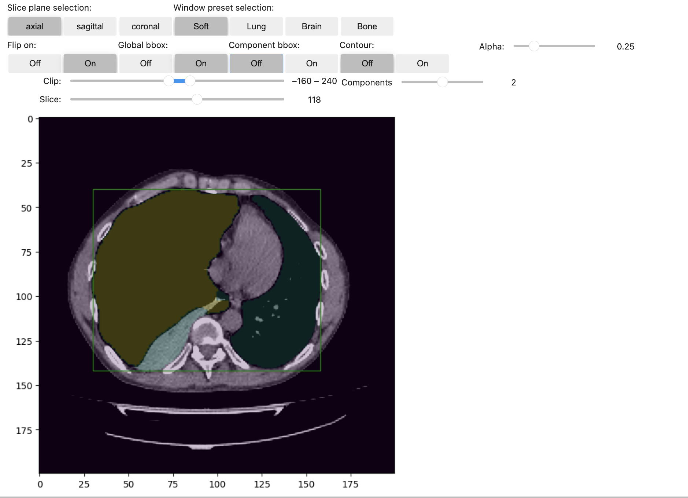

# Medical-viewer
Simple tool for looking at 3d images


PatientViewer3D is a Python class for interactive visualization of 3D medical images, such as CT or MRI scans, with optional segmentation masks. It allows users to explore different image planes (axial, sagittal, coronal) and apply visualization settings like windowing, alpha transparency, contour lines, and bounding boxes for connected components.

## Features

- Interactive 3D Slice Viewer: Toggle between axial, sagittal, and coronal views.
- Window Presets: Soft tissue, lung, brain, and bone windowing for appropriate visualization.
- Segmentation Mask Overlay: Display and customize alpha transparency of segmentation masks.
- Connected Components: Automatically detect and visualize connected components within the mask.
- Bounding Boxes: Display global and per-component bounding boxes on the image.
- Contour Visualization: Enable contour lines to better define the edges of segmentation masks.

## Examples

<div style="display: flex; flex-wrap: wrap; justify-content: space-between;">

  <div style="margin: 10px; flex: 0 0 45%;">
    
    <p>Lungs</p>
  </div>

  <div style="margin: 10px; flex: 0 0 45%;">
    
    <p>Pneumothorax</p>
  </div>

  <div style="margin: 10px; flex: 0 0 45%;">
    
    <p>Hydrothorax</p>
  </div>

  <div style="margin: 10px; flex: 0 0 45%;">
    
    <p>Aorta</p>
  </div>

</div>


## Requirements

The following Python packages are required:

- numpy
- matplotlib
- ipywidgets
- cc3d
- opencv-python (cv2)
- IPython

You can install the required packages using pip:

## Installation

1. Clone the repository:
    ```bash
    git clone <repository-url>
    ```
2. Navigate to the cloned directory:
    ```bash
    cd <repository-directory>
    ```
3. Install the dependencies in editable mode:
    ```bash
    pip install -e ./
    ```

## Usage

Here’s an example of how to use the PatientViewer3D class:

```python
import numpy as np
from patient_viewer import PatientViewer3D

# Example 3D volume and mask (replace with your own medical data)
volume = np.random.rand(256, 256, 100)  # Replace with actual medical image data
mask = np.random.randint(0, 2, (256, 256, 100))  # Replace with actual segmentation mask

# Initialize the viewer with the 3D volume and mask
viewer = PatientViewer3D(volume=volume, mask=mask)
```

## License

This project is licensed under the MIT License.
